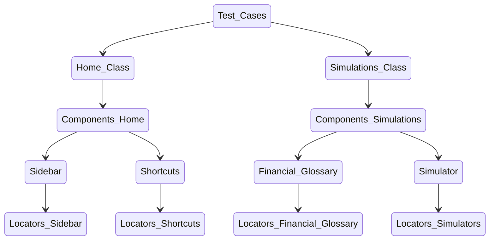

# Framework UI Template

## 1. Scripts

| Script          | Description                                                                                                     |
| --------------- | --------------------------------------------------------------------------------------------------------------- |
| build           | Compile TypeScript files using TypeScript Compiler (tsc)                                                        |
| check-debug-tag | Check for debug tags in test files and exit with an error message if found                                      |
| clear:storage   | Remove authentication files from the Playwright storage folder                                                  |
| clean           | Delete the `dist` directory to start fresh                                                                      |
| debug           | Run Playwright tests in debug mode with Chromium browser                                                        |
| lint            | Lint TypeScript files using ESLint and fix linting issues where possible                                        |
| local           | Run Playwright tests locally in Chromium with retries disabled                                                  |
| prebuild        | Clean the `dist` directory before compiling TypeScript files                                                    |
| prepare         | Set up Husky Git hooks for pre-commit actions                                                                   |
| pre-commit      | Run lint-staged on pre-commit to check and fix linting issues                                                   |
| prettier        | Format code using Prettier across specified files                                                               |
| record          | Generate Playwright test scripts                                                                                |
| ready           | Clean `dist`, `node_modules`, and `package-lock.json`, then log in to AWS CodeArtifact and install dependencies |
| report          | Show the Playwright test report                                                                                 |
| test:ci         | Run Playwright tests for continuous integration                                                                 |
| test:run        | Run Playwright tests in Chromium with retries disabled and tagged with `@debug`                                 |
| test:safari     | Run Playwright tests in Safari with retries enabled and tagged with `@debug`                                    |
| test:ui:debug   | Run Playwright tests with a graphical interface and tagged with `@debug`                                        |
| trace           | Show the Playwright test trace                                                                                  |
| ui              | Run Playwright tests with a specific UI port configuration                                                      |
| validate        | Check TypeScript types without emitting files                                                                   |

## 2. Usage

1. **Install Dependencies**: Run `npm install` to install project dependencies.
2. **Build**: Run `npm run build` to compile TypeScript files.
3. **Run Tests**:
   - `npm run test:ci` to run all tests in headless Chromium.
   - `npm run test:run` to run tests in Chrome with a graphical interface.
   - `npm run debug` to run test in debug mode \*\* You need add @debug tag on test case.
4. **Linting**: Use `npm run lint` to check for linting errors.
5. **Formatting**: Use `npm run prettier` to format code according to project standards.

### 2.1 Configuration

- Modify Playwright test configurations in `playwright.config.ts`.
- Adjust ESLint rules in `.eslintrc.json`.
- Define Prettier rules in `package.json`.

### 2.2 AWS Dependencies

- Utilize AWS SDK clients for Cognito, DynamoDB, Lambda, S3, and more.
- AWS CodeArtifact login and repository setup are integrated into deployment scripts.

## 3. Development

- `lint-staged` and `husky` are set up to run ESLint and Prettier on staged files before commit.

### 3.1 Dependencies

| Dependency                                  | Version | Description                                                       |
| ------------------------------------------- | ------- | ----------------------------------------------------------------- |
| `@aws-sdk/client-cognito-identity-provider` | 3.572.0 | AWS SDK client for Cognito Identity Provider                      |
| `@aws-sdk/client-dynamodb`                  | 3.572.0 | AWS SDK client for DynamoDB                                       |
| `@aws-sdk/client-lambda`                    | 3.572.0 | AWS SDK client for AWS Lambda                                     |
| `@aws-sdk/client-s3`                        | 3.572.0 | AWS SDK client for Amazon S3                                      |
| `@aws-sdk/lib-dynamodb`                     | 3.572.0 | AWS SDK library for DynamoDB                                      |
| `@faker-js/faker`                           | ^8.4.1  | Library for generating fake data                                  |
| `@playwright/test`                          | ^1.44.0 | Framework for writing Playwright tests                            |
| `@tsconfig/node20`                          | 18.2.4  | TypeScript configuration for Node.js 20                           |
| `cross-env`                                 | ^7.0.3  | Utility to set environment variables across platforms             |
| `dotenv-extended`                           | ^2.9.0  | Extended version of dotenv for managing environment variables     |
| `eslint-config-airbnb-base`                 | ^15.0.0 | ESLint configuration based on Airbnb's style guide (Base rules)   |
| `eslint-config-airbnb-typescript`           | ^18.0.0 | ESLint configuration for TypeScript based on Airbnb's style guide |
| `eslint-config-prettier`                    | ^9.1.0  | ESLint configuration to disable rules that conflict with Prettier |

### 3.2 DevDependencies

| Dependency               | Version | Description                                     |
| ------------------------ | ------- | ----------------------------------------------- |
| `eslint-plugin-prettier` | ^5.1.3  | ESLint plugin to run Prettier as an ESLint rule |
| `prettier`               | 3.2.5   | Tool for code formatting                        |

## 4. Folder Structure

With this structure, we aim to implement the Factory Method Pattern to create maintainable tests. Additionally, we use the Builder Pattern to build tests faster and focus on creating functional tests, avoiding technical issues.

```
# Folder Structure
.
├── dist/                 # Compiled TypeScript files
├── playwright/           # Utility functions for performing various actions in Playwright
├── test-setup/           # Test setup configurations
├── tests/                # End-to-end test scripts
├── tests/pages           # Structure of components and locators
   ├──── login            # Login Example
        ├── components    # Login Components
        ├── locators      # Login Locators
        │   └── login-page-locators.ts  # Nomenclature <component>-page-<locators>.ts
        └── login-component-page.ts     # Parent Page
     └── login-page-class.ts            # Root Page
├── .eslintrc.json        # ESLint configuration
├── .husky/               # Husky hooks
├── package.json          # Project dependencies and scripts
├── playwright.config.ts  # Playwright configuration
├── README.md             # Project README (you are here)
└── tsconfig.json         # TypeScript compiler options
```

### 4.1 Components Structure



## 5. Contribution Guidelines

- Follow the [Conventional Commits](https://www.conventionalcommits.org/en/v1.0.0/) standard for commit messages.
- Name pull requests using the format **`feat(Ticket Code): Brief Description What I did`**

## 6. Agreements to Accept Pull Requests

- **Descriptive Test Case Titles**: Ensure that the title of the test case clearly reflects the main functionality being tested.
- **Single Responsibility Principle (SRP)**: Follow the SRP in your code. Each module, class, or function should have one and only one reason to change.
- **Efficient Promise Handling**: Use `Promise.all` for validating multiple texts simultaneously to improve performance and code clarity.

## Notes

- This template assumes Chromium is required for Playwright tests.
- Adjust AWS SDK versions based on project requirements.
